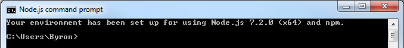

# TinyApp
For a friend learning React, who complained about the initial setup.

And for those who sometimes feel like doing some coding on their Windows machine
between matches in Dota 2, League, Overwatch, etc.

## Install Node.js for Windows
Download the latest version of Node.js from https://nodejs.org/en/

Once it's installed, open up the Node.js command prompt.

### Create your project directory
`cd Desktop`

`mkdir TinyApp`

`cd TinyApp`

## Setup your package.json file
`npm init --yes`

You will need the following packages:
* react
* react-dom
* babel-core
* babel-loader
* babel-preset-react
* babel-preset-es2015
* babel-preset-stage-0
* webpack
* webpack-dev-server

`npm i -S react react-dom babel-core babel-loader babel-preset-react babel-preset-es2015 babel-preset-stage-0 webpack webpack-dev-server`
